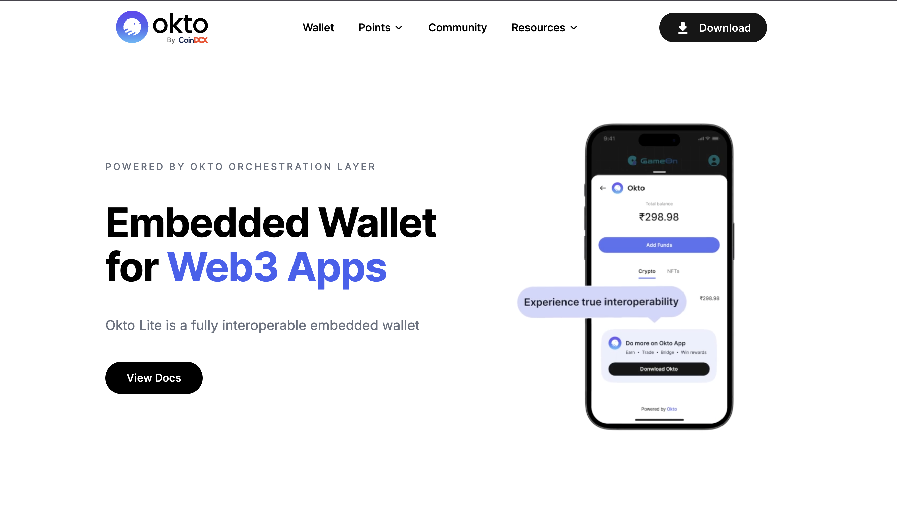
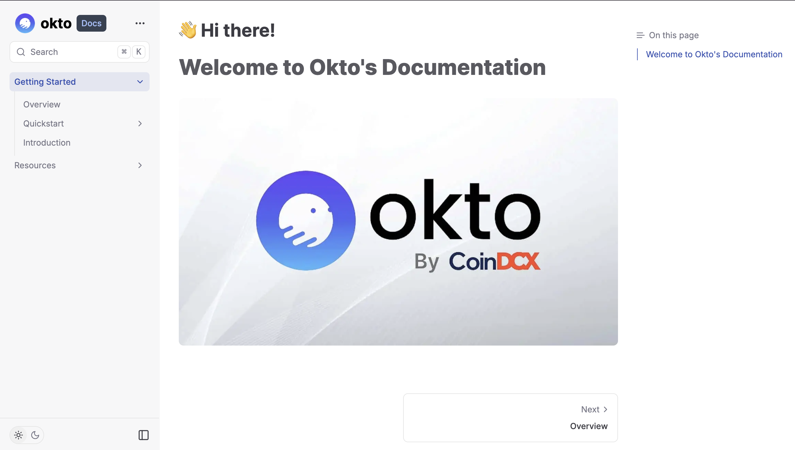

# Welcome to Okto SDK Documentation (Demo)
This project is developed as part of a task, to create demonstrable documentation for Okto using the Fumadocs framework.

## Key features of the Documentation
- Overview of the Okto Layer with illustration.
- Demo support for React, Flutter and React Native SDKs.
- Code snippets to get you started in no time.
- Resources to do troubleshooting or advance customization.
- Available in both Light and Dark mode.

### A Glimpse to the website



## Run the Project Locally
Clone the repository
```shell
git clone https://github.com/aditi-dsi/okto-docs.git
```
Go to the project directory
```shell
cd okto-docs
```
Install the dependencies
```shell
npm install
```
Start the server
```shell
npm run dev
```
The local project will be up and running on https://localhost:3000.

<br>

The code for the main website homepage can be found here https://github.com/aditi-dsi/okto-tech.
