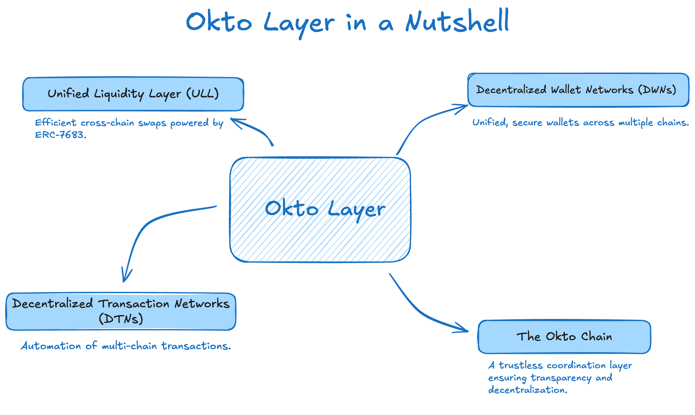

## Introduction to Okto layer

Okto Layer is a middleware framework that simplifies Web3 user experience by abstracting the compelexities of blockchain technology and covering it through its user-friendly unified interface. This concept resulted in the development of the Okto SDK that enables developers to build seamless Web3 applications without worrying about cross-chain interoperability, liquidity fragmentation, multi-step transactions and so on.

## Key Features

- Unified Wallet Access: Manage multiple blockchain wallets under one roof.

- Cross-Chain Liquidity: Efficient and cost-effective token swaps.

- Automated Transactions: Simplified, automated multi-chain workflows.

- Developer-Friendly SDKs: Intuitive APIs and SDKs to get started quickly.

